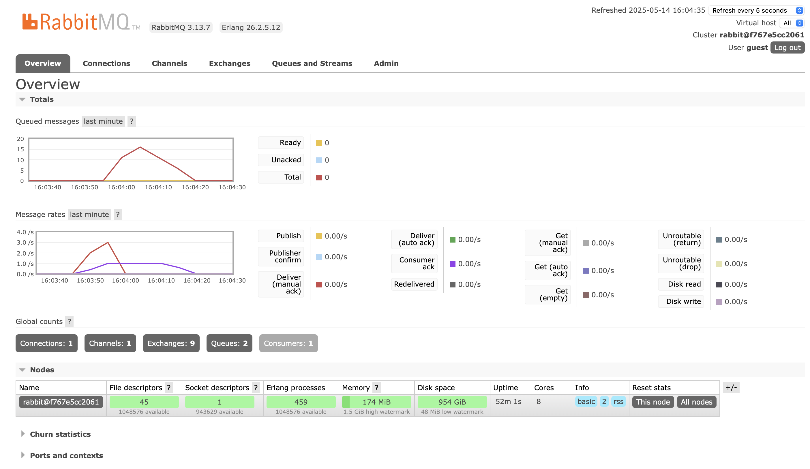

1. **What is AMQP?**

   AMQP (Advanced Message Queuing Protocol) is an open, standardized application layer protocol for message-oriented middleware. It defines how messages are structured, routed, and delivered between producers and consumers, ensuring reliable, interoperable, and secure communication across different platforms.

2. **What does `guest:guest@localhost:5672` mean?**

   - **Username (`guest`)**: the user name for authenticating with the AMQP broker.  
   - **Password (`guest`)**: the password for that user.  
   - **Host (`localhost`)**: the machine where the broker is running.
   - **Port (`5672`)**: the TCP port on which the broker listens for AMQP connections (5672 is the default port).

- Simulation slow subscriber
   
   The total number of messages in the queue reached 16 on my machine. The publisher was publishing faster than the subscriber could process them, so events piled up until the subscriber caught up and began clearing the backlog.
